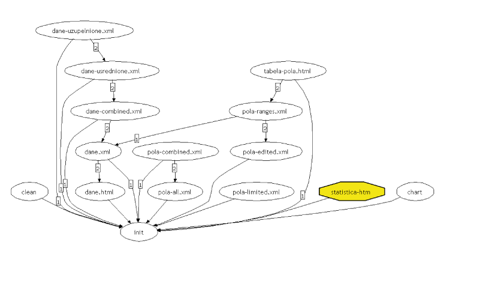

# JIM Computer Analysis System [Chapter 6]
The development of the JIM system took place simultaneously with the data analysis. Its main task was to convert the data into format compatible with the analyzing and reasoning system. The conversion also included data filtering and conducting an additional expert interview. Additionally, the system was to make possible the selection and training of the network independently of the SNN software. 
Full system specifications are included in “Appendix A: Specification of the JIM system requirements”. Additional CD contains the code.

System functionality includes:

* Initial processing of the data and expert knowledge
* Recording patients’ data in an xml open format files
* Automatic knowledge acquisition from data
    * Heuristic selection of appropriate network architecture best fitted for the type of data
* Inferring on patients based on previously acquired knowledge – the outcome of this phase is recorded into xml format. 

## Presentation of potentially useful tools for implementing the selected inference engine

### STATISTICA
STATISTICA[^foot-statsoft] is an integrated data analysis software suite. The neural network module first appeared in version no.5, as an independent application. It has been since integrated with the suite starting from version 6. It is available in the STATISTICA Neural Network package. There is also a STATISTICA Neural Networks Code Generator, which allows exporting of the generated network into external C/C++ code or into PMML (Predictive Model Markup Language). The package implements many network training algorithms and additionally contains own heuristics for choosing the right architecture for the given problem. 

### SNNS - Stuttgart Neural Network Simulator
Available under GNU license for research purposes. Last version dates back to 1998. Later, the interface implementation in Java appeared.[^foot-snns] 

### CILib – Computational Intelligence Library
Library implementing a host of artificial intelligence problems.[^foot-cilib] Maintained by the Pretoria University, South Africa. It covers:
* Swarm intelligence
* Evolutionary algorithms
* Neural networks
* Artificial immunological systems
* Fuzzy logic

### JAGA – Java API for Genetic Algorithms
A relatively new project, still in the beta phase. Included analytical tools make it promising.[^foot-jaga]

### JGAP – Java Genetic Algorithms Package
Version 1.0 of the package means it is now fully functional.[^foot-jgap] Implemented are the basic genes and operations. It is interesting since it can be integrated with JOONE. Has the OSI[^foot-osi] certification.

### JOONE – Java Object Oriented Neural Engine
This library is currently intensely developed. It implements neural networks by building them from readymade elements. User chooses the layer type, number of connections and so on separately.[^foot-joone]

There exist a complete graphical environment, in which testing and creating networks is possible. Networks are trained exclusively by back propagation of errors. The DynamicAnnealing module modifies the training parameters dynamically, which optimizes the whole process. 1.1.0 is the current version, with improvements of approx. 35% over the previous one and supporting multi-processor computers. It is capable of parallel computations within a cluster. Capability of storing networks in the ANNML (Artificial Neural Network Markup Language) is planned. ANNML is an XML based PNML expansion. 

### Saxon
Referential implementation[^foot-saxon] of  XSLT 2.0, XPath 2.0 and XQuery 1.0.

### AppLib – Approximation Library for Java
Project developed under Alexander I. Rozhenko.[^foot-applib] It implements interpolations using the splines method.

### Eclipse
Free programming environment for the Java language. It has evolved into a universal programming environment. IBM is the project’s patron.[^foot-eclipse]

## Discussion on the system selected from the perspective of tools available
The initial objective was to model knowledge on patients undergoing desensitization treatment in a neural network, by using the STATISTICA Neural Networks software. The network was then to be exported into an independent application. Unfortunately, exporting was only available in STATISTICA Neural Networks Code Generator. License cost was too high for the project’s budget. 
Alternative plan consisted of finding a flexible environment for working on data and neural networks. It was important that the tools and libraries used were licencensed as open source: GNU GPL or BSD variant. 

During initial stages of the project it was decided that all possible data would be stored in XML format and that, when feasible, the data operations will be transformations of the XSLT. Initial conversion of source data from the CSV format into XML was performed using Perl. 

The utilization of XML was useful due to the availability of freeware editors and the possibility of defining a coherent data processing methodology. Some charts used in this thesis are conversions of XML data into SVG vector graphics (XML). To reduce the cost of the typical programming errors and to make the project platform-independent, Java was chosen as the implementation language. 
XSLT 2.0 was used for data transformation. Xpath 1.0, being a part of XSLT 1.0, did not allow addressing elements by the names contained in variables.  During developing of the system, Saxon was the only library capable of XSLT 2.0 transformations. 

Initial data processing required data gap-filling. Interpolation using splines was selected as a method, due to the medical data characteristics. Only complete data could be used for training of networks. 

The neural networks library had to be fast and as flexible as possible. There was an additional risk that the personal computer used for training network would be too slow. The requirements were met by the JOONE project. It was a safe solution, since it also featured extensions for distributed computing (JOONE-distributed). The code for network activation is so small that it can potentially be run on PDA-type devices, which is an interesting development path for the system. For the needs of the system, the JOONE library was expanded with XML input and XHTML output support. 

The next phase required a tool for the network topology selection. CILib, JAGA and JGAP were considered. CILib implemented genetic algorithms in narrowest capacity. JAGA was still in beta and at the time of module’s implementation a sample code using the library was missing. JGAP needed expanding with Double gene. Therefore, a org.jim.election.genes.DoubleGene class was created, consisting of 126 Non Commented Lines of Code. JGAP had good documentations and examples.

[Table 14 Summary of technologies employed][Table 14]
| Name/Description | Choice | Rationale | Remarks |
| --- | --- | --- | --- |
| Stage 1: Converting textual data into xml | perl | Language optimized for textual data processing | |
| Stage 2: Filtering data based on the expert advice | xslt | Language optimized for xml->xml conversion | After expert’s conclusions were written up, an xml file was created |
| Stage 3: Data gap-filling | java, xslt | Part of data processing was convenient in xslt. Interpolation using secondary splines. Existing java numerical libraries were used | |
| Stage 4: Knowledge extraction from data | java | Large number of libraries, transferability | Neural network library selected: joone, Network architecure selection library chosen: jgap |
| Stage 5: Infering | java | Infering means transoforming the xml patients’ data into output data (conlusions), by using an engine and knowledge. Stage 5 shares the code with Stage 4. | |
| Transformation coordination tool | ant | Native xslt, java support (compiling, method developing) | |
| ANN library | Joone | Open, well documented. Capacity for distributed computing. Easy implementation of custom input/output layers | Library has been modified by expanding with xml input data support |
| Data imaging | xslt, svg | svg is an xml expression of graphical objects. Transformation of xml data in svg by using xslt is natural. | |
| Transformation | mainly xslt 2.0 | Well defined standard. Capable of converting xml into any variation of xml. | Objective was to create some appendixes and figures as xml->pdf conversion |
| Xslt transformation | saxon | Closest implementation of xslt 2.0 (working draft). The author of library  collaborates on defining the standard | |
| Data format | xml | Univarsal format. Large number of libraries and editors interpreting and checking the syntax compatibility. | |

## Build report
User interface is available through the Ant tool. JIM system achieves multiple “targets”, which are the subsequent data processing stages. Ant allowed for transparent depicting of the dependency relations of processing stages

Figure 11 Relations of the transformations products

### Completer
The module responsible for data-gaps filling and calculating additional factors

### Range Selector
The module calculating the data ranges, so that they could be normalized before the training. Additionally, the module recognized whether a parameter had continuous or discrete values and whether it was a classifier. 

### Teacher
Teacher of a network with a predetermined structure

### Executor
This module activated the network with given data

### NetworkArchitectureElector
The module heuristically selected the networ’s architecture, by employing genetic algorithms. The resulting architecure were recorded as chromosomes.  

### ChromosomeTeacher
The module trained the network based on the architecture stored in the chromosome. 

The configuration of the all the above modules is contained in the jim.properties file. It contains information on: the localization of data file (data_input.xml), field normalization values file (pola_normalizacja), network parameters file (serialized_network), and file storing the inference results (execution_output_html). Additionally, it contains a matrix specification of input and predicted data stored as xpath format queries.  Input data matrix for the training set consists of patients selected with the “learning-xpath” query and  the parameters describing patients selected with “input_xpath” query. Output parameters are defined in the “output_xpath” query. Similarly, the “testing_xpath” query defines the patients testing the network, and the “validating_xpath” defines patients validating the network.

Sample config file:

    execution_output_html=./data.output/store.html
    data_input_xml=./data.preprocessed/dane-completed.xml
    pola_normalization=./data.conf/pola-ranges.xml
    serialized_network=./data.nn/store.jnn
    input_xpath=*[self\:\:wywiad or self\:\:w1]/*
    output_xpath=computed/stopien_pogorszenia_max
    learning_xpath=//pacjenci/pacjent[(position() <\= 32) and ((position() mod 5) > 1)]
    testing_xpath=//pacjenci/pacjent[(position() <\= 32) and ((position() mod 5) \= 1)]
    validating_xpath=//pacjenci/pacjent[(position() <\= 32) and ((position() mod 5) \= 0)]

### Summary
The system starts by converting the existing patients’ database into xml format. Since that moment, all operations are transformations of data from xml to xml. Doctor interview was recorded as xml and merged with the existing data by a relevant transformation. Thanks to that, the system is very flexible and, with little work, allows for processing of any other type of data requiring a prediction of continuous values. 

The system implements all the mentioned requirements except those concerning the graphical interface. The complexity of the task was too high to start working on it, when the data available for analysis would not allow for a proper regression. 
